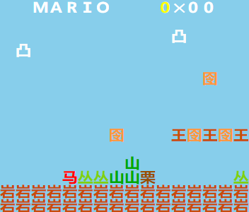
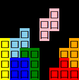
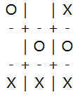
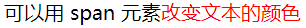
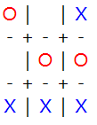
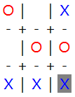
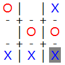

# 引言

欢迎来到全角游戏引擎的制作教程，绕过 OpenGL，从零开始开发一个超简单的游戏引擎！我将会一边自己摸索着开发，一边更新教程的。感兴趣的话欢迎跟着一起做。

这个游戏引擎的本质就是用字符画来显示游戏画面，此类游戏也被称为[文字式游戏](https://zh.wikipedia.org/wiki/%E6%96%87%E5%AD%97%E5%BC%8F%E6%B8%B8%E6%88%8F)。计算机历史上有过许多的文字式游戏，其中不乏优秀的作品。本游戏引擎稍微不同的一点是：只使用全角字符。

## 为什么用全角字符？

这里说的全角字符，既包括汉字，也包括英文字母或者阿拉伯数字的全角表示[^1]。全角字符是显示字形为固定的“一个字的宽度”的字符。这意味着对于绝大部分字体，全角字体是等宽的。而等宽又意味着很容易对齐。

看一个例子，前者是普通字符（半角），后者是全角字符：

* nice day!

* ｎｉｃｅ　ｄａｙ！

可以看出，前者对于阅读文本来说更好看；但后者的每一个字符，即使是字母 i，都是一样宽的。这样的性质可以让我们更好地显示游戏画面，而不用太纠结字符的对齐问题。

考虑用字符来显示一个井字棋棋局，如果用半角实现的话，显示如下：

> O\| \|X<br />
> -+-+-+<br />
>  \|O\|O<br />
> -+-+-+<br />
> X\|X\|X<br />

由于默认不是等宽字体，导致各个字符的宽度相差很大。这里 O 和 X 两个字符的宽度还比较相近，但是和竖线（\|）、空格（ ）、加号（+）、减号（-）等字符比的话，宽度相差就比较明显了，最后的显示效果不佳，比较凌乱。

再用全角字符显示同样的棋局试试：

> Ｏ｜　｜Ｘ<br />
> －＋－＋－<br />
> 　｜Ｏ｜Ｏ<br />
> －＋－＋－<br />
> Ｘ｜Ｘ｜Ｘ<br />

全角字符等宽，自动就对齐了，最后的结果也好看多了。

## 游戏引擎是什么？

简而言之，游戏引擎是制作游戏的工具，利用同一个游戏引擎可以开发许多不同的游戏。一个好的游戏引擎可以让游戏开发更加简单、高效。业界常用的游戏引擎有 Unity、Unreal 等。本教程要做的游戏引擎是一个极其简单、只求能跑的玩具。当然，开发游戏引擎的过程中肯定需要实现一些具体的游戏或者游戏场景来验证功能。

## 希望可以实现的效果

在游戏引擎的实现比较简单的前提下，希望尽可能地支持更多的显示效果与游戏功能。下图是制作的一些演示，仅供参考。





## 这个教程适合谁，不适合谁？

本教程适合有一定的编程基础，且对制作游戏或者制作游戏引擎感兴趣的同学，想要玩一玩就行。

本教程不适合没有编程经验的同学；也不适合想要学习游戏引擎的工业实践的同学，这个游戏引擎只是一个玩具，笔者也没啥正经的游戏开发经验。

建议的编程基础：

* 有面向对象的编程经验。
* 对 HTML、CSS 和 JavaScript（包括 DOM）有一定的了解。

如果没有相关的编程基础，可以先看看教程，不需要把握所有的细节，大概看看然后自己写写就好。也可以试着在学习相关概念后跟着本教程练习。对于上述的编程基础，本教程可能会稍作介绍，但不会详细说明。推荐的中文教程网站：

* W3school：https://www.w3school.com.cn/
* 菜鸟教程：https://www.runoob.com/

## 总体的设计思路

数据通路是：游戏模型 --> 画面数据 --> 网页

游戏模型需要随着时间与玩家的键鼠输入发生改变。

这里暂时不需要理解。

## 开始第一步吧

首先我们试着将一个简单的游戏画面用静态的网页表示出来，还是以井字棋为例，不过加上几个新需求：

1. X 用蓝色字符，O 用红色字符，格子用黑色字符。
2. 背景颜色为白色，最后一个落下的子背景颜色为灰色。
3. 宽高相等。

接下来会一步步介绍如何实现这些需求，最后的产物的链接为：[../src/misc/tic-tac-toe-demo.html](../src/misc/tic-tac-toe-demo.html)

### 最基本的显示

新建一个 HTML 文件，搭起一个 HTML 框架，直接把上面的井字棋全角棋局放进一个 div 元素里，然后试试打开网页看效果。会发现所有的字符都挤在同一行，这是因为 HTML 文本的换行并不会直接反映到显示效果上。因此，我们需要在每一行结尾加上换行元素 `<br />`，得到如下代码：

```html
<!DOCTYPE html>
<html>
<head>
    <meta charset="UTF-8" />
    <title>井字棋演示</title>
</head>
<body>
    <div>
        Ｏ｜　｜Ｘ<br />
        －＋－＋－<br />
        　｜Ｏ｜Ｏ<br />
        －＋－＋－<br />
        Ｘ｜Ｘ｜Ｘ<br />
    </div>
</body>
</html>
```

显示效果如图：



看着还行。

### 新需求一：给字符加颜色

接下来做第一个新需求：X 用蓝色字符，O 用红色字符，格子用黑色字符。

给特定的文本加上颜色，可以使用 `<span>` 元素。这是一个通用的 HTML 行内元素，可以通过设置其 style 属性来改变文本的 CSS 样式。例如：

```html
可以用 span 元素<span style="color:red;">改变文本的颜色</span>
```

显示效果为：



类似地，将棋局里的 O 和 X 加上 `<span>` 元素设置颜色。而由于浏览器默认的字体颜色是黑色[^2]，因此格子的颜色就不需要专门设置了。我们可以得到如下代码：

```html
<!DOCTYPE html>
<html>
<head>
    <meta charset="UTF-8" />
    <title>井字棋演示</title>
</head>
<body>
    <div>
        <span style="color:red;">Ｏ</span>｜　｜<span style="color:blue;">Ｘ</span><br />
        －＋－＋－<br />
        　｜<span style="color:red;">Ｏ</span>｜<span style="color:red;">Ｏ</span><br />
        －＋－＋－<br />
        <span style="color:blue;">Ｘ</span>｜<span style="color:blue;">Ｘ</span>｜<span style="color:blue;">Ｘ</span><br />
    </div>
</body>
</html>
```

看代码感觉有点乱了，但是显示效果还不错：



### 新需求二：给字符加背景颜色

第二个新需求：背景颜色为白色，最后一个落下的子背景颜色为灰色。

浏览器默认的背景颜色就是白色，因此不需要专门设置全局的背景颜色。最后一个落下棋子的背景颜色则同样通过 `<span>` 元素的样式来设置。这次我们使用 `background-color` 属性，选定一个落子作为最后一个落下的子，添加 `background-color:grey;` 的 CSS 样式设置，显示效果为[^3]：



实现了第二个需求。

### 新需求三：宽高相等

到目前位置，这个井字棋的画面已经像模像样了。但如果仔细观察，会发现目前画面的高度略大于宽度，导致整体的棋盘呈现出长方形而非正方形。这是因为浏览器的默认样式存在一定的行间距，可以使得文本更美观，但这不是我们显示游戏画面所需要的。行间距同样可以通过 CSS 的样式来调节，样式名为 `line-height`，行高。我们在包裹住全部内容的 `div` 的样式表中加入这个设置：`line-height:1em;`。将行高设置成了 1 em。这里 em 是相对单位，1 em 表示和当前的字符的默认大小相等。将行高设置成当前字符的大小，就相当于将行间距设置成 0，满足了我们的宽高相等的需求[^4]。看看效果[^3]：



不错的，长宽基本相等了。

### 总结

至此，你已经迈出了第一步。最终生成的游戏画面就和你现在手写的网页在原理上没什么差别，唯一的区别是游戏的网页要通过程序脚本自动生成，而你是手写的。下一节，我们将会尝试使用程序脚本自动生成游戏界面。


## 脚注
[^1]: 输入英文字母或者阿拉伯数字默认会打出半角字符，但输入法有全角开关开启全角输入。具体如何开启可以自行搜索。
[^2]: 暂不考虑夜间模式等情况。
[^3]: 完整的代码可以参考此链接：[../src/misc/tic-tac-toe-demo.html](../src/misc/tic-tac-toe-demo.html)
[^4]: 这里的理解比较粗浅，但目前基本够用了。
